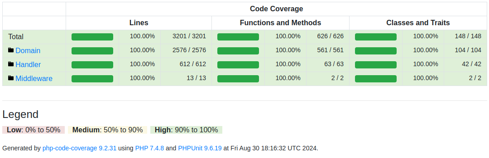

# WalkWeb Site

Platform for creating websites on various themes.

Work in progress.

## Install

`git clone https://github.com/WalkWeb/WalkWeb-Site.git .`

`composer install`

`cp config.php config.local.php`

Set yours params in config.local.php

## Tests

`cp config.php config.test.php`

Set yours params in config.test.php

`migrations/bin/run`

`migrations/bin/fixtures`

`make test`

Test coverage (result in html directory):

`make coverage`

## Screenshots

Game Theme:

`define('TEMPLATE_DEFAULT', 'inferno');`

`define('THEME', 2);`

IT Theme:

`define('TEMPLATE_DEFAULT', 'default');`

`define('THEME', 1);`

